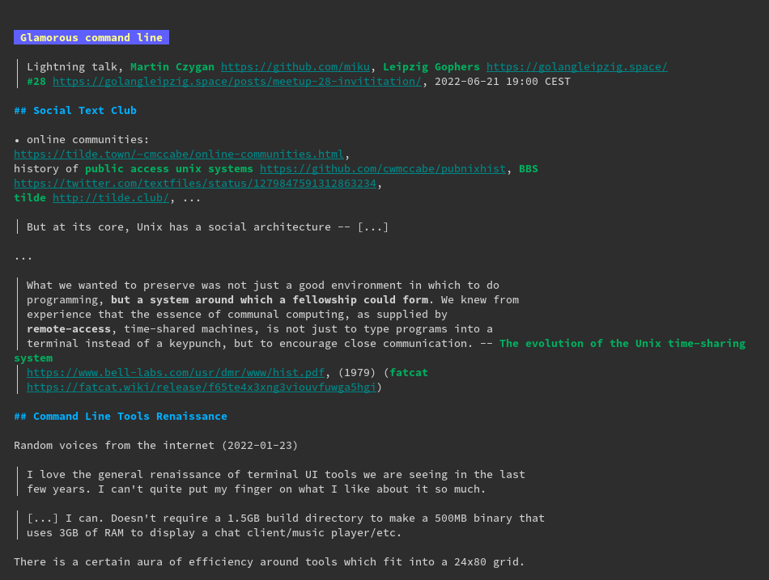

# Glamorous command line apps

> Lightning talk, [Martin Czygan](https://github.com/miku), [Leipzig Gophers](https://golangleipzig.space/)
> [#28](https://golangleipzig.space/posts/meetup-28-invititation/), [2022-06-21 19:00 CEST](https://www.meetup.com/leipzig-golang/events/282941935/)

## Social Text Club

* online communities:
  [https://tilde.town/~cmccabe/online-communities.html](https://tilde.town/~cmccabe/online-communities.html),
history of [public access unix systems](https://github.com/cwmccabe/pubnixhist), [BBS](https://twitter.com/textfiles/status/1279847591312863234),
[tilde.club](https://tilde.club/), [tilde.town](https://tilde.town), ...

> But at its core, Unix has a social architecture -- [...]

...

> What we wanted to preserve was not just a good environment in which to do
> programming, **but a system around which a fellowship could form**. We knew from
> experience that the essence of communal computing, as supplied by
> **remote-access**, time-shared machines, is not just to type programs into a
> terminal instead of a keypunch, but to encourage close communication. -- [The evolution of the Unix time-sharing system](https://www.bell-labs.com/usr/dmr/www/hist.pdf), (1979) ([fatcat](https://fatcat.wiki/release/f65te4x3xng3viouvfuwga5hgi))

## Command Line Tools Renaissance

Random voices from the internet (2022-01-23)

> I love the general renaissance of terminal UI tools we are seeing in the last
> few years. I can't quite put my finger on what I like about it so much.

> [...] I can. Doesn't require a 1.5GB build directory to make a 500MB binary that
> uses 3GB of RAM to display a chat client/music player/etc.

There is a certain aura of efficiency around tools which fit into a 24x80 grid.

## Glow Markdown Reader



Simple, but pleasant.

## Charm and Universe

Charm builds cli support tools, OSS
[company](https://www.crunchbase.com/organization/charm-1814); [Changelog
481](https://changelog.com/podcast/481), ...

A dozen plus open source projects:

* bubbletea tui library
* wish ssh middleware
* ...

## ELM architecture

* Model-View-Update

TODO: example; chart

## More Apps

### Stock Ticker

* [https://github.com/achannarasappa/ticker](https://github.com/achannarasappa/ticker)

```
$ ticker --show-fundamentals -w META,GOOG,AMZN,MSFT,AAPL,NVDA
```

> Love it.


### Mergestat

Actually, is it true that 80% of the changes to a project are made in 20% of
the files? Let's run some SQL over a git repository ...


```sql
$ cat authors.sql
SELECT author_name, count(*)
FROM commits -- replace repo
WHERE parents < 2 -- ignore merge commits
GROUP BY author_name ORDER BY count(*) DESC
LIMIT 20
```

```shell
$ cat authors.sql | \
    mergestat -r ~/code/rclone/rclone/ -f tsv-noheader | \
    column -ts $'\t'

Nick Craig-Wood       4152
albertony             165
Ivan Andreev          130
Fabian Möller         114
buengese              66
Stefan Breunig        51
remusb                41
klauspost             29
Cnly                  29
Chaitanya Bankanhal   22
edwardxml             21
Tim Gallant           21
Gary Kim              21
ishuah                20
Klaus Post            20
Aleksandar Jankovic   20
Alex Chen             19
Martin Michlmayr      18
Dan Walters           18
Anagh Kumar Baranwal  17
```

Most modified files in a repo:

```
$ mergestat -f tsv < modified.sql | column -ts $'\t'
file_path                         COUNT(*)
docs/content/authors.md           70
backend/s3/s3.go                  18
docs/content/s3.md                16
docs/content/docs.md              15
go.mod                            13
backend/sftp/sftp.go              13
go.sum                            12
docs/content/jottacloud.md        12
fstest/test_all/config.yaml       11
fs/operations/operations.go       11
docs/content/drive.md             11
backend/azureblob/azureblob.go    11
backend/ftp/ftp.go                10
backend/box/box.go                10
fs/operations/operations_test.go  9
docs/content/ftp.md               9
docs/content/flags.md             9
docs/content/crypt.md             9
backend/onedrive/onedrive.go      9
backend/jottacloud/jottacloud.go  9
```

Our question (using [rclone](https://github.com/rclone/rclone/) repo):

* commit last year

```
$ git log --pretty=format:"%H" --since 1.year.ago | wc -l
712
```

* commits in the **top 20** most touched files

```
$ mergestat -f tsv-noheader < modified.sql | \
    column -ts $'\t'  |
    awk '{print $2}' |
    paste -sd+ |
    bc -l
287
```

Total number of files in the repo: 2087. **So 40% of the commits happen in less
than 1% of the files**.

* [x] [Power Law](https://en.wikipedia.org/wiki/Power_law) ([Power Laws in Software](https://www.spinellis.gr/pubs/jrnl/2008-TOSEM-PowerLaws/html/LSV08.pdf) (2008), [citing ...](https://fatcat.wiki/release/nphgdtcrbjguvgd2qoq7tmeoiy/refs-in))

### Go Test Coverage Explorer


### Task Timer

### Time Zone (tz)

### Confetty

### Draw

### Catalog
