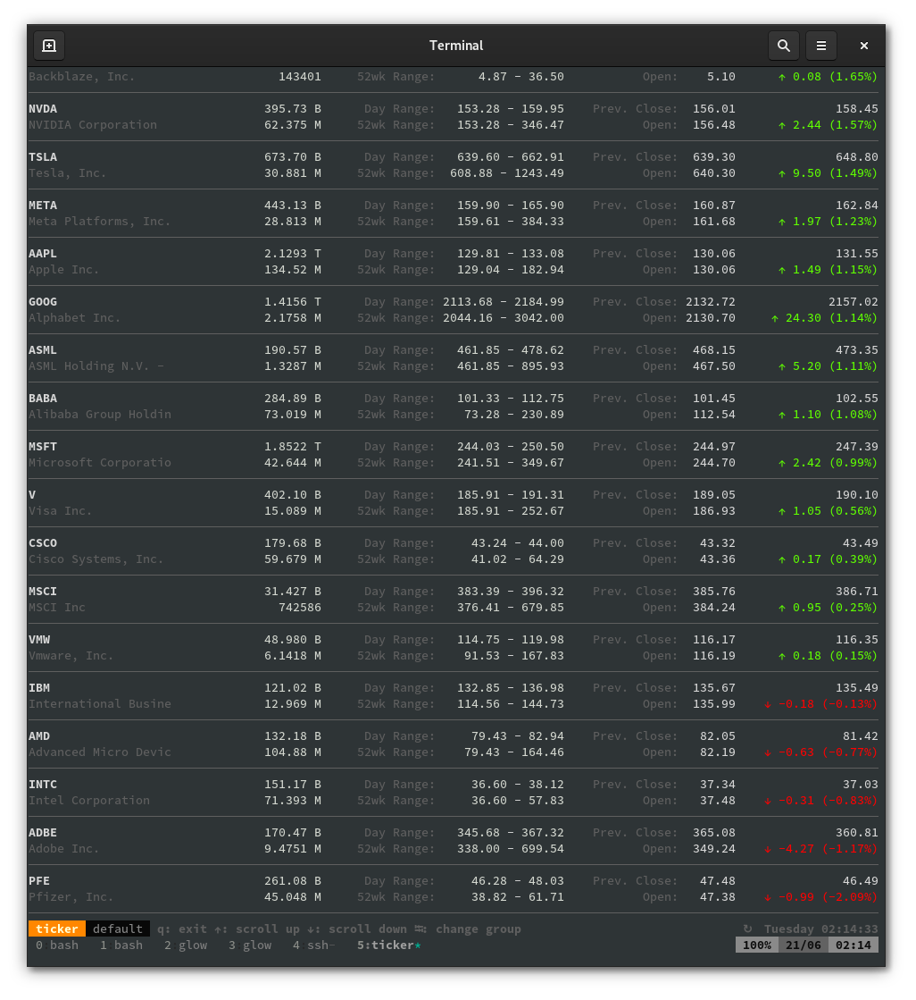

# Glamorous command line

> Lightning talk, [Martin Czygan](https://github.com/miku), [Leipzig Gophers](https://golangleipzig.space/)
> [#28](https://golangleipzig.space/posts/meetup-28-invititation/), 2022-06-21 19:00 CEST

## Social Text Club

* online communities:
  [https://tilde.town/~cmccabe/online-communities.html](https://tilde.town/~cmccabe/online-communities.html),
history of [public access unix systems](https://github.com/cwmccabe/pubnixhist), [BBS](https://twitter.com/textfiles/status/1279847591312863234),
[tilde](http://tilde.club/), ...

> But at its core, Unix has a social architecture -- [...]

...

> What we wanted to preserve was not just a good environment in which to do
> programming, **but a system around which a fellowship could form**. We knew from
> experience that the essence of communal computing, as supplied by
> **remote-access**, time-shared machines, is not just to type programs into a
> terminal instead of a keypunch, but to encourage close communication. -- [The evolution of the Unix time-sharing system](https://www.bell-labs.com/usr/dmr/www/hist.pdf), (1979) ([fatcat](https://fatcat.wiki/release/f65te4x3xng3viouvfuwga5hgi))

## Command Line Tools Renaissance

Random voices from the internet (2022-01-23)

> I love the general renaissance of terminal UI tools we are seeing in the last
> few years. I can't quite put my finger on what I like about it so much.

> [...] I can. Doesn't require a 1.5GB build directory to make a 500MB binary that
> uses 3GB of RAM to display a chat client/music player/etc.

There is a certain aura of efficiency around tools which fit into a 24x80 grid.

## Glow Markdown Reader


Simple, but pleasant.

## Charm

Charm builds cli support tools, OSS
[company](https://www.crunchbase.com/organization/charm-1814); [Changelog
481](https://changelog.com/podcast/481), ...

## Universe

* bubbletea tui library
* wish ssh middleware

## ELM

* Model-View-Update

## Examples


### Stock Ticker

* [https://github.com/achannarasappa/ticker](https://github.com/achannarasappa/ticker)

```
$ ticker --show-fundamentals -w META,GOOG,AMZN,MSFT,AAPL,NVDA
```


